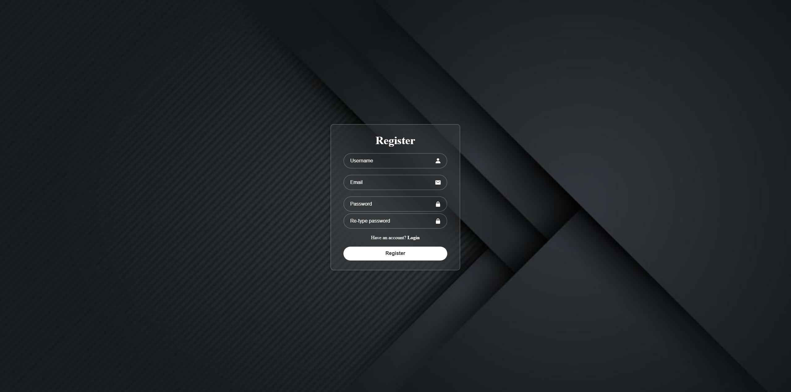
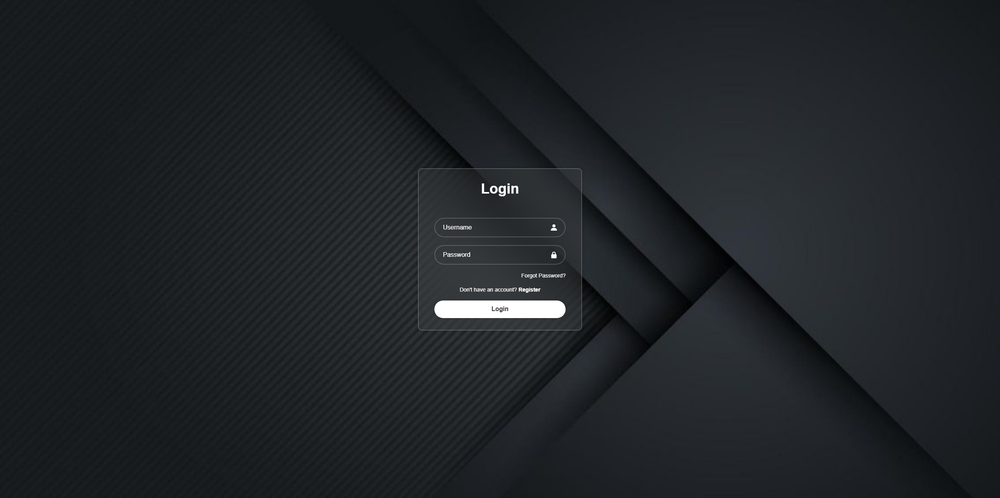
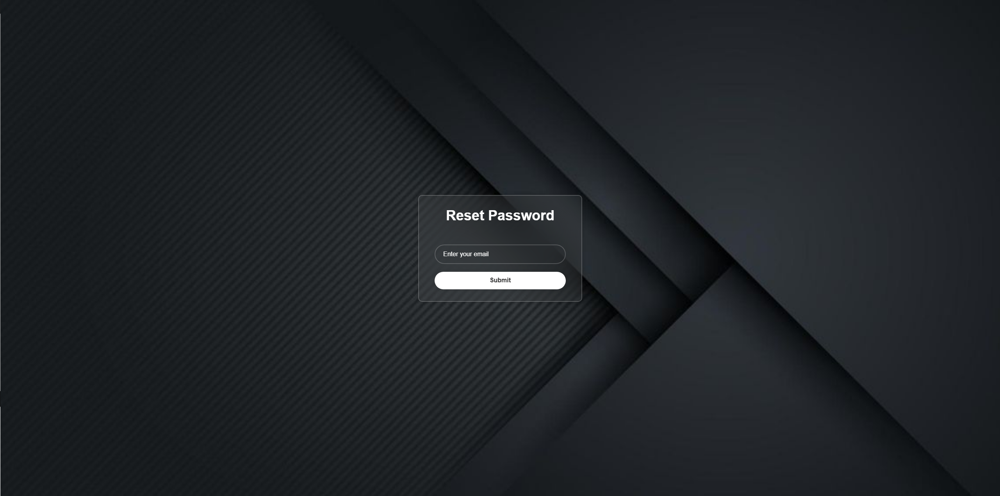
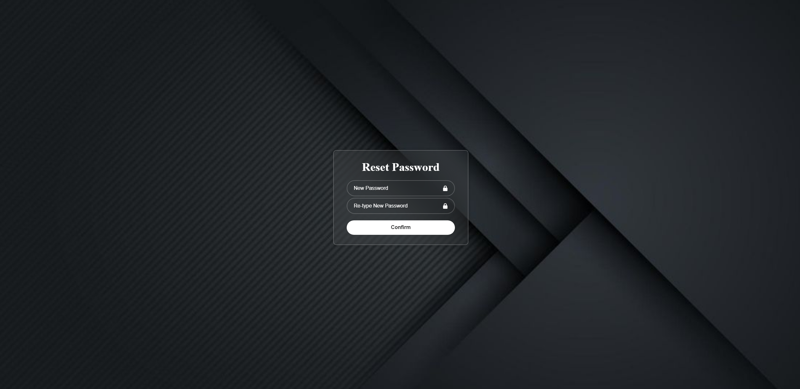
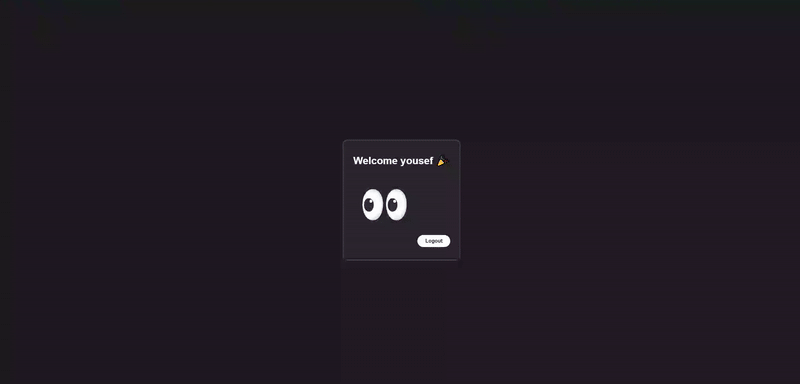

# User Authentication Web App 


A **full-featured user authentication system** with registration, login, OTP verification, and password reset. Built with **Django REST API backend**.  

---

## Features
- ✅ User registration with **validation**  
- ✅ Login with **JWT authentication**  
- ✅ OTP verification for registration & password reset  
- ✅ Password reset via **email OTP**  
- ✅ Responsive and visually appealing UI  

---

## Tech Stack
- **Frontend:** HTML5, CSS3, JavaScript, Boxicons  
- **Backend:** Django REST Framework  
- **Authentication:** JWT (JSON Web Tokens)  

---

## Sending OTP
The system sends OTPs to users via email for registration and password reset.  

To configure email settings, look at the **bottom of `settings.py`** in the backend. There, you can set up the SMTP server, email, and password for sending OTPs.

---

## Screenshots

**Register Page**  
  

**Login Page**  
  

**OTP Verification**  
 

**Resetting Password**  


**Set Password**  


**Home Page**  


---

## Quick Start

1. Clone the repository:

```bash
git clone https://github.com/Yousef10p/Authentication-System.git
```

2. (Optional but recommended) Create a virtual environment:
```bash
python -m venv venv
# Activate it:
# Windows
venv\Scripts\activate
# Mac/Linux
source venv/bin/activate
```

3. Install dependencies (Backend):
```bash
pip install -r requirements.txt
```

4. Configure email settings for OTP in settings.py:
```bash
# Example
EMAIL_BACKEND = 'django.core.mail.backends.smtp.EmailBackend'
EMAIL_HOST = 'smtp.gmail.com'
EMAIL_PORT = 587
EMAIL_USE_TLS = True
EMAIL_HOST_USER = 'your_email@example.com'
EMAIL_HOST_PASSWORD = 'your_email_password'
```
**Note:** `EMAIL_HOST_PASSWORD` must be an [App Password](https://myaccount.google.com/u/1/apppasswords) if using Gmail.

5. Create the database:
```bash
python manage.py migrate
```

6. Run the Django server:
```bash
python manage.py runserver
```

7. Open index.html in your browser for frontend testing.